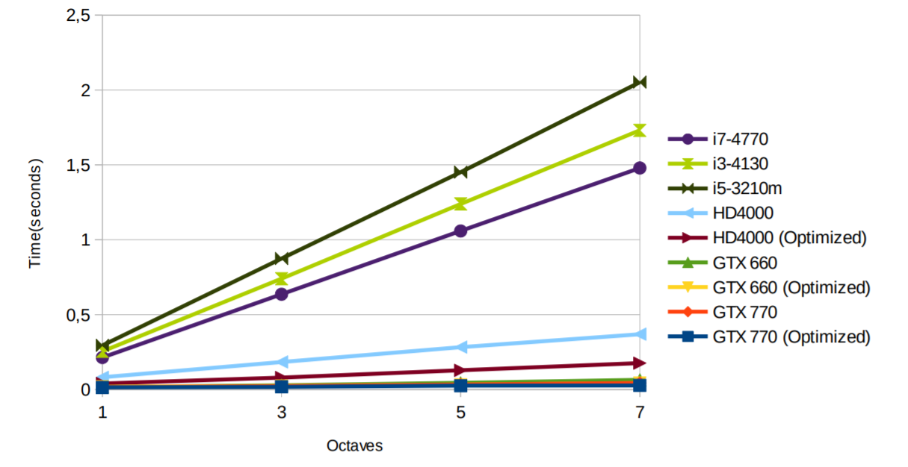
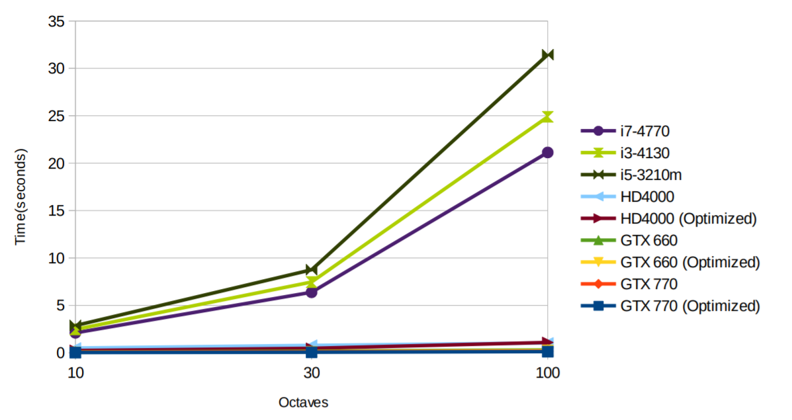

[](https://jitpack.io/#micycle1/jSimplex)

# jSimplex
A Java library for calculating simplex noise on the GPU.

This library is born from *Jaan Janno*'s thesis, which may be accessed [here](https://comserv.cs.ut.ee/home/files/janno_informaatika_2015.pdf?reference=88272778F99F86CDF2D499048061343DD48D279D&study=ATILoputoo).

## Overview
jSimplex provides parallel calculation of simplex noise. The library executes noise calculations on a GPU if it is available; if not, it falls back to using the CPU. The user may edit the following parameters that affect the properties of the noise:

1. Number of dimensions (2 to 4 dimensions supported)
2. The size of the returned array of noise and its location in the generated noise space.
3. Frequency of the noise.
4. Number of octaves. (the number of sub-frequencies in the noise)
5. Persistence. (the weighted extent by which sub-frequencies affect the noise)

## Usage

```
// Position in the noise space.
float xPosition = 0, yPosition = 0;
// How large the main patterns of the noise are.
float frequency = 0.003f;
// How large of an effect smaller frequencies have.
float persistence = 0.5f;
// Number of lower frequencies.
int octaves = 50;
// How many points of noise we need along a dimension.
int width = 1024, height = 1024;
// Determines if the library uses the optimized noise functions.
boolean fast = true;

float[] noise = NoiseSurface.generate2dRawOctaved(xPosition, yPosition, width, height, frequency, persistence, octaves, fast);
```

## Performance
The charts below compare noise generation computation time between different CPUs and GPUs, across multiple octaves.

Note that computation time has a less than linear dependence on the number of octaves. A probable cause for this is that the computation is bounded more by memory bandwidth.

<p float="middle">
  <a></a>
  <a></a>
</p>